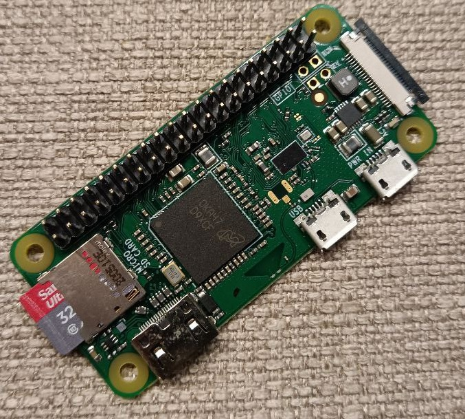
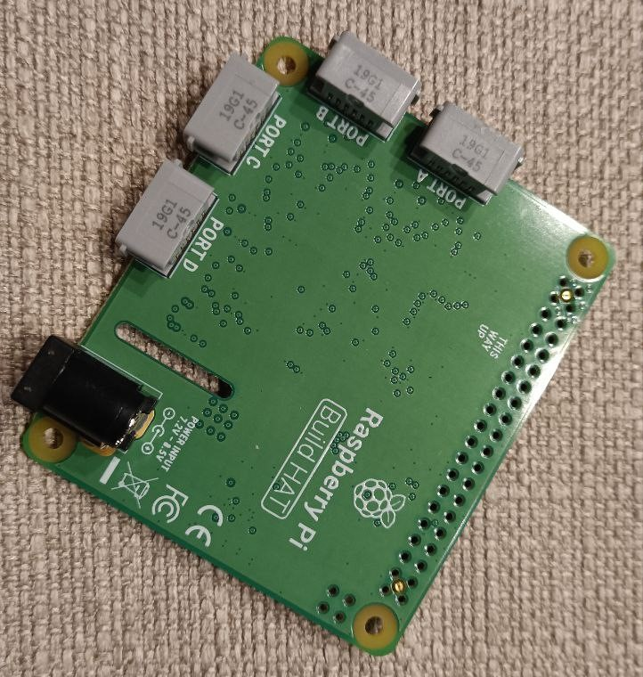
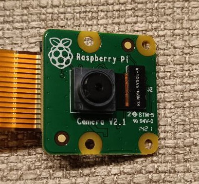
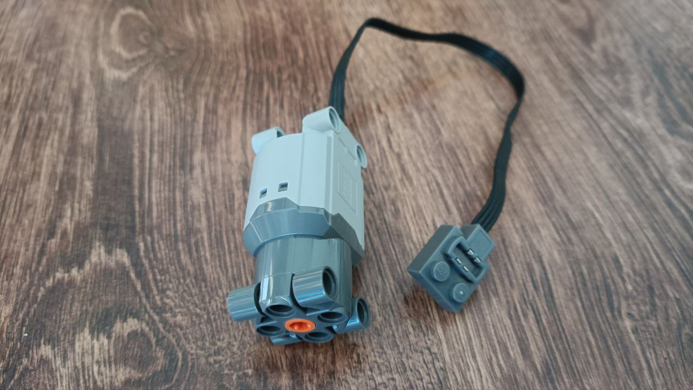
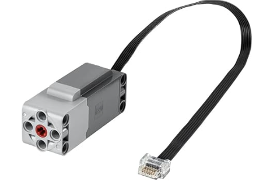
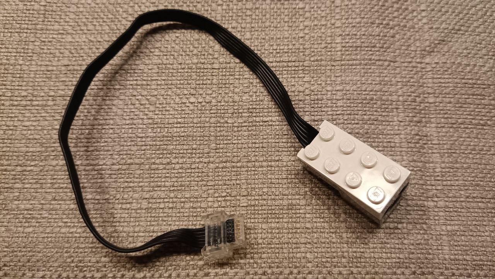
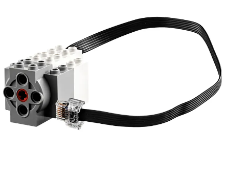
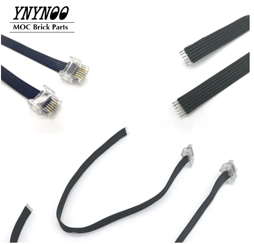

## 1. Raspberry Pi 
- Zero W  
  
- [Build HAT](https://www.raspberrypi.com/documentation/accessories/build-hat.html)  

- PiCamera  

## 2. Lego Components
- 2x LEGO Power Functions - L Motor (99499)  

- LEGO Powered Up - L Motor (88013)  
 
- LEGO Powered Up - Farb- & Abstandssensor (88007)  

- LEGO Powered Up - mittlerer Linearmotor (88008)    

## 3. Other
- LEGO Powered Up Cable (Ali Express)  

## Adapter
- [link](https://www.1000steine.de/de/gemeinschaft/forum/?entry=1&id=440039)

## Projects

- [LEGO remote controlled car](https://projects.raspberrypi.org/en/projects/lego-robot-car/0)